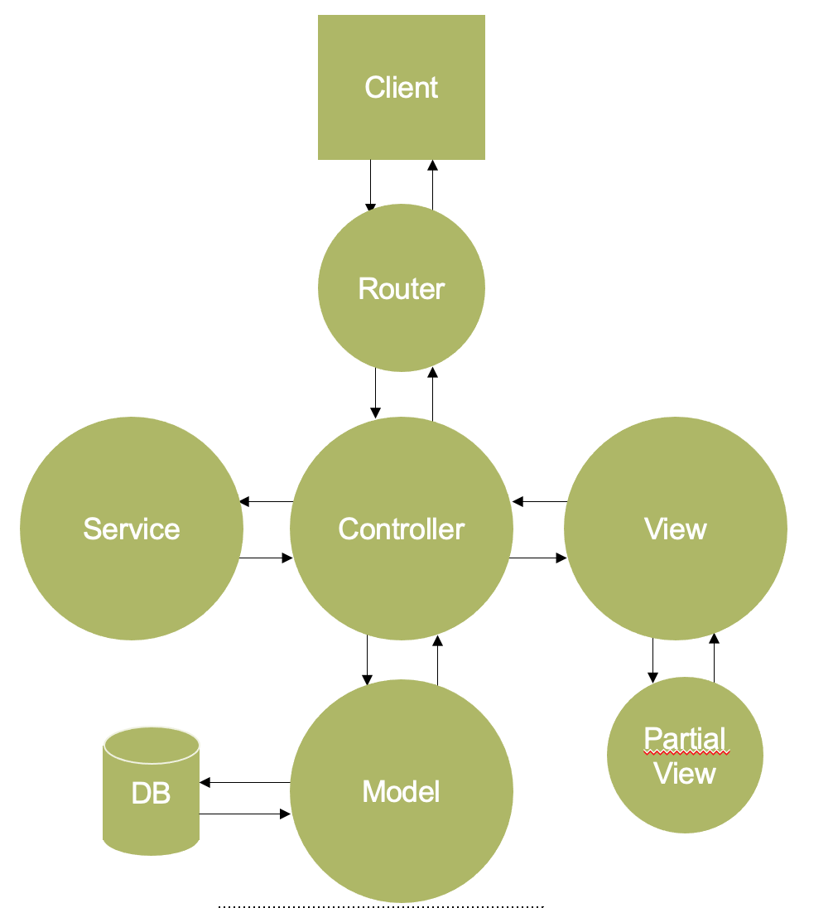

# Exam questions

## Questions
  - What is Human Computer Interaction?
    - Human Computer Interaction er et felt, der indeholder mange discipliner.
      Der bredt set handler om interaktion mellem mennesker og computere. HCI
      ligger i feltet mellem software engineering, design og menneskelig
      psykologi. 
  - What is a Design Sprint?
    - Et design sprint er en metode/arbejdsform til hurtigt at kunne generere
      løsninger på alle typer problemer. Spredt ud over 5 dage har vi
      - Mandag - formulér problemet, map, spørgs eksperter
      - Tirsdag - Sketching
      - Onsdag - bestem løsning og storyboard
      - Torsdag - prototyping
      - Fredag - testing på brugere
    Her tester vi på rigtige bruger af vores fremtidige produkt for at finde ud
    af de problemer vi måtte have, samt om vi skal arbejde videre, eller
    forkaste den idé vi har.
  - What is User Testing?
    -  Vi laver user testing af
      en idé, og ikke af et produktet. Så en user test er noget vi laver meget
      tidligt i processen. Vi vil med en user test gerne finde ud af om det
      overhovedet er pengene værd at bruge tid på projektet vi står foran.
  - What is Usability Testing?
    - Vi laver usability testing for at identificere issues i et eksisterende
      design, således at man kan rette den givne fejl på et senere tidspunkt.
      Man kan også lave usability testing på erstattede systemer.
  - How do you design for Accessibility?
    - En webside skal være accessible for mange slags personer, hvad enten de er
      farveblinde, blinde, personer med nedsat syn, døve eller har andre fysiske
      handicap.
      Fx for personer med nedsat syn, blinde eller ordblinde er skærmlæsere med
      et vigtigt værktøj. Derfor er det vigtigt at man designer således at en
      hjemmeside kan anvende af disse. 
      Det gør man ved at bruge de HTML tags der skal til fx <nav> til en
      navigationsbar og <h1> til titlen på hjemmesiden. Der findes en guideline
      til dette, denne kaldes for WCAG (Web Content Accessebility Guidelines).
  - What is SEO and how do you do it?
    - SEO står for search engine optimization. SEO handler om rankeringen i en
      søgemaskine. Rankeringen afhænger af mange ting. Om HTML og CSS er valid,
      om mange linker til siden, og hvad disse links indeholder. SEO handler
      også om accessibilty, hvor siden bliver nedpriorieret fx hvis siden ikke
      har alt attributter på billeder. Dette blev også vist da vi anvendte
      Google Lighthouse til at teste vores prototype af produktet for at få en
      bedre SEO score.
  - How does the MVC design pattern work?
    - MVC er Model View Controller. Denne ser således ud:
      { width=500px }.
      Client spørger controlleren, controller samler data
      fra modellen, sender data til view som populater viewet med data.
      Controller sender det populatedede view tilbage til clienten.
  - What is Composite UI?
    -  Composite UI er en forbedring på MVC. Denne gør således at vi frit kan
       eksposere et API. Vores vores bruger API et, denne kommunikation kunne
       være via. JSON som jo er native til javascript. Det er controlleren der
       ekposer APIet. Controller retunerer data fra service og modellen.
       Det bevirker at frontend kun skal være opmærksom på et sprog, modsat hvis
       vi havde brugt en view engine.
  - What is a microservice?
    - 
  - What languages does a browser understand?
    - En browser forstår \underline{kun} HTML, CSS og Javascript. Hvis det er
      noget end disse, for at en browser skal kunne forstå det, skal der
      oversættes til disse tre. 
  - What is a persona?
    - 
  - What is a map?
  - What is a storyboard?
  - What is a prototype?
  - What is skeumorphism
    - Skeumorphisme beskriver objekter i interfacet der efterligner de virkelige
      funktioner de repræsenterer. Et eksempel er papirkurven på et skrivebord,
      hvor man kasserer filer. 

## Explain
  - HTML
    - HTML står for Hyper Text Markup Language. HTML definerer strukturen på
      hjemmesiden, og binder CSS og Javascript sammen. Når HTML er loaded laver
      den the Document Object Model (DOM), dette er denne som Javascript kan
      manipulere emner i.  HTML starter og slutter med \texttt{html} tags, dette
      er rodelement i DOMen. Og \texttt{head} indeholder den usynlige data så
      som \texttt{meta}-tags og \texttt{style}-tags.  \texttt{body} indeholder
      det man kan se. Man skal deklarere \texttt{<script/>}.

      På enhver side skal der være en header \texttt{<h1></h1>}. Man
      laver links med \texttt{<a></a}. Man inkludere billeder med
      \texttt{} i HTML, vi kan også
      lave et HTML element der definerer en style for det ene HTML dokument. Vi
      kan også sætte style med \texttt{style=""} i HTML dokumentet.
        
      - Vi vælger DOM elementer med fx \texttt{h1}.
      - Vi vælger klasser med \texttt{.class (dot class)}
      - Vi vælger id'er med \texttt{\#id}  

      Specificity er det pointssystem der bestemmer hvilke værdier der gælder
      for et bestemt element. Der gives point i denne rækkefølge:
      - Element
      - Class/Pseudo-class attribut
      - ID
      - HTML Style attribute
      - \texttt{!important}

  - JavaScript
    - Med JavaScript vi manipulere HTML DOM (Document Object Model). JavaScript
      er et Turing-komplet sprog. Med Javascript kan vi beskrive, hvad der skal
      ske når man fx trykke på en knap med en \texttt{onClickListener}.
  - jQuery
    - jQuery er et JavaScript-bibliotek. Meningen med jQuery er at gøre det
      nemmere at skrive JavaScript.  jQuery virker over mange forskellige
      browsere og giver et ensartet API at interagere med når man skal
      manipulere HTML DOMen, dermed er det godt til kompatibility.
      Efter ECMAScript 6 er det næsten lige så nemt at skrive JavaScript som det
      er at skrive jQuery. Man støder dog stadig på det overalt.

      jQuery bruger meget tegnet \$, derfor skal man tænkte jQuery når man der
      et \$.
      Bootstrap bruger jQuery.
  - Bootstrap
  - Leaflet
    - Leaflet er et JavaScript-bibliotek til at inkludere kort på sin side.
    Inkluderes i et CSS dokument og et JavaScript dokument.
  - Google Charts
    - Med Google Charts kan man få diagrammer, som lagkagediagrammer,
      søjlediagrammer og grafer på sin side. Man inkluderer det bare i et script
      tag, og laver et placeholder \texttt{div} i sit HTML dokument, som man kan
      populate senere. Man kan hover over data for at få specifikke tal. 
  - Bitmaps and Vector
    - Et bitmap er et gitter af farver (RGB eller RGBA), hvor hver firkant har
      en bestemt farve.  Her er densiteten af gitteret dens opløsning (jo flere
      firkanter jo højere opløsing). 
      PNG understøtter RGBA, hvor A står for Alpha som er en
      gennemsigtighedsværdi.-
    - En vektor er en beskrivelse af en form fx en linje eller en firkant, eller
      hvilken som helst anden mønster. En vektor består af punkter, formen
      beskrives af disse punkter og hvordan disse er sat sammen. Hvert punkt har
      to håndtag til at beskrive hvordan det sættes sammen med det forrige og
      det næste.

## Talk about 
  - Graphic Design
    - Grafisk design er et håndværk hvor folk kreerer visuelt indhold for at
      kunne kommunikere et budskab. Her er virkemidlerne fx side layout og
      typografi for at imødekomme brugerne behov, og dermed optimere
      brugeroplevelsen. En god brugeroplevelse kan være med at genere
      troværdihed for fx en onlineshop, da de fleste kigger på siden for at
      bedømme om den er troværdig eller ej.
  - Design Guidelines and Design Systems
    - Et bestemt system eller OS kan have bestemte Design Guidelines. Fx at når
      man swiper fra venstre og ind på iOS forventer brugeren at man har går
      tilbage, hvor man på Android kunne forvente en menu.
    - Et design system er et prædefineret system, for hvordan menuer, knapper
      mv. skal se ud. Et eksempel på et design system er designsystem.dk, hvor
      enten Virk.dk eller Borger.dk temaet kan bruges til offentlige hjemmeside.
      På den måde undgår man at skulle opfinde den dybe tallerken i hvert et.
      offentligt IT-projekt.
