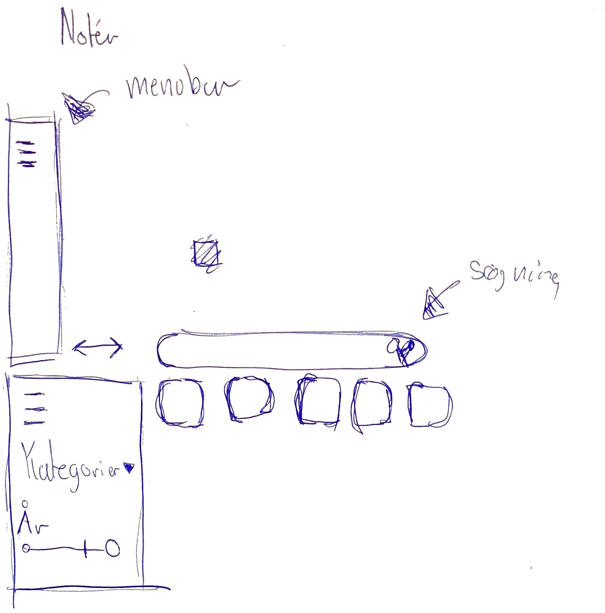

% Human Computer Interaction
% Peter Heilbo Ratgen
% 20. januar 2021

# Problemstillingen 
  - Long term goal: 
    \begin{center}
    Gøre det lettere for brugeren at finde film ud fra valgte
    streamingstjenester eller eget bibliotek.
    \end{center}
  - Target customer: bruger/gæst 
  - Target event: Bruger kigger efter film/kigger efter film kategorier  

## Fokuspunkter
  - Tirsdag - Sketching
  - Torsdag - Prototyping

# Sketching 
  - Lightning demos
  - Idéer til løsninger på problemet
  {  width=200px }

# Sketching - fortsat
  - Crazy 8's
  - Solution sketches
    - Detaljeret hypotese

# Sketching - Takeaways
  - Flere notater i processen med lightning demos
  - Solution sketches
    - En sketch hver
    - Alle skal (og kan) tegne
  - For meget diskussion i mellem processens steps
    - Decideren og facilitatorens roller
  - Dogme omkring minimalt værktøj er værdifuldt
      
  <!---# Ingen skal hæves over andre fordi de har bedre værktøj.-->

# Prototyping
  - Den mindst testbare version
  - Failing fast
  - Valg af værktøj
    - Figma

    <!---#For simple, fast, free web concepts to test on devices, use Figma -->

  - Divide and conquer
    - 2 hold
  - At stykke prototypen sammen
  - Testing

# Prototyping - Takeaways
  - Fordele ved divide and conquer
    - Makers, stitcher, writer, asset collector(s), interviewer

# Konklusion
  - At følge processen i Sprint
    - Roller
